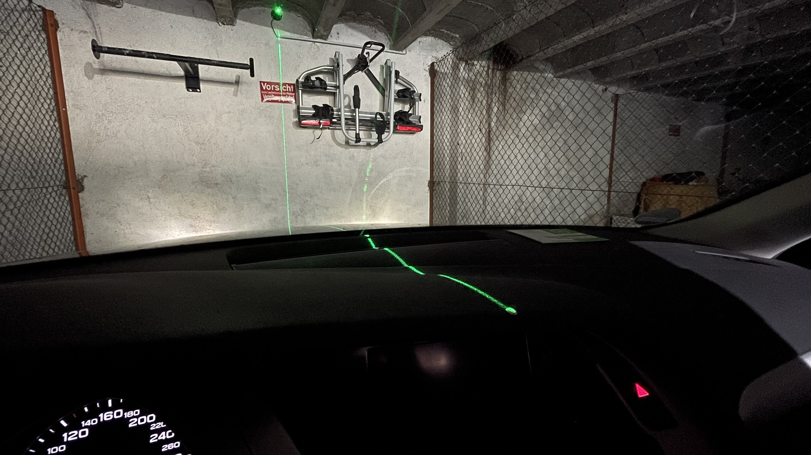
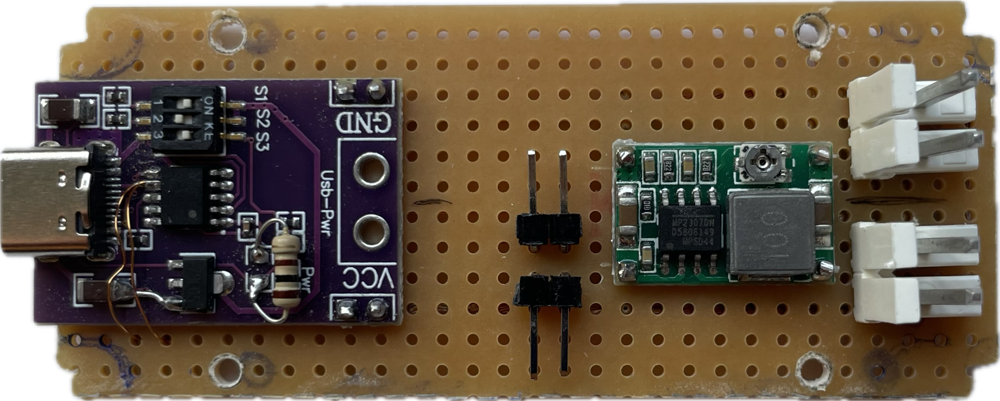
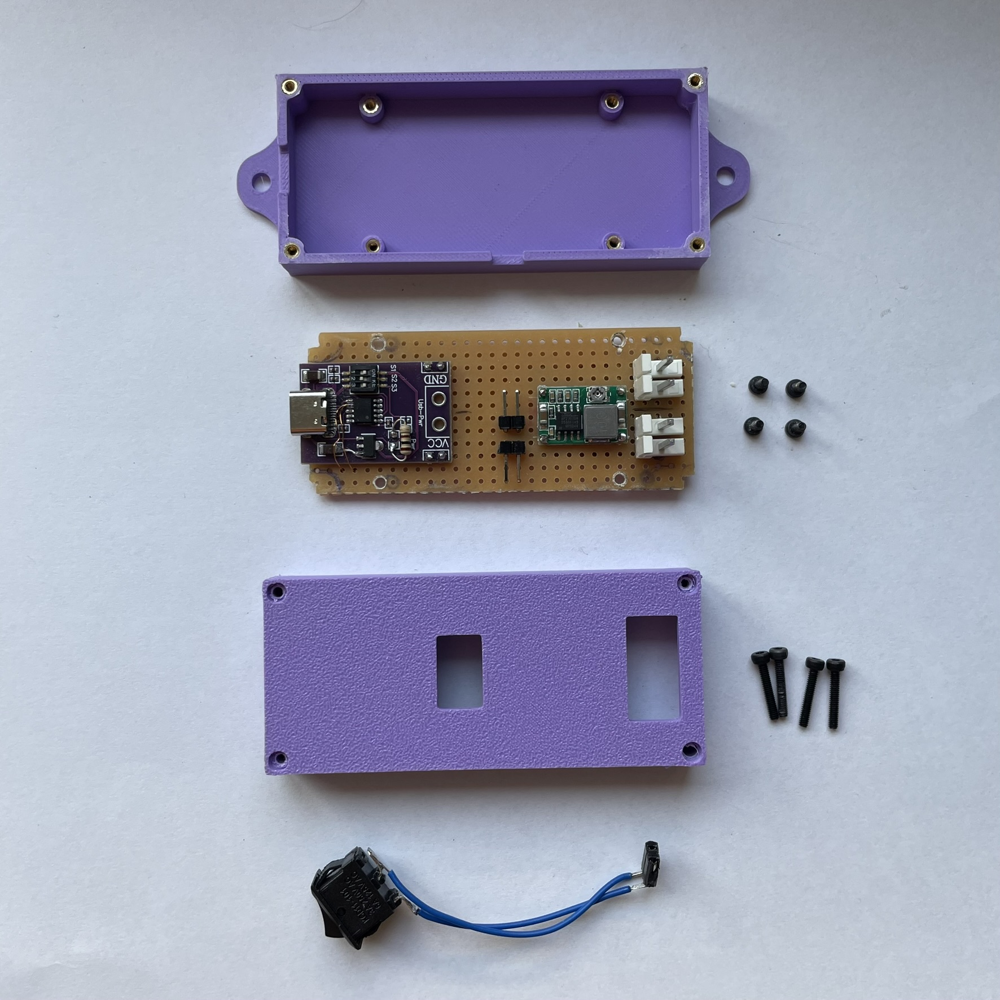
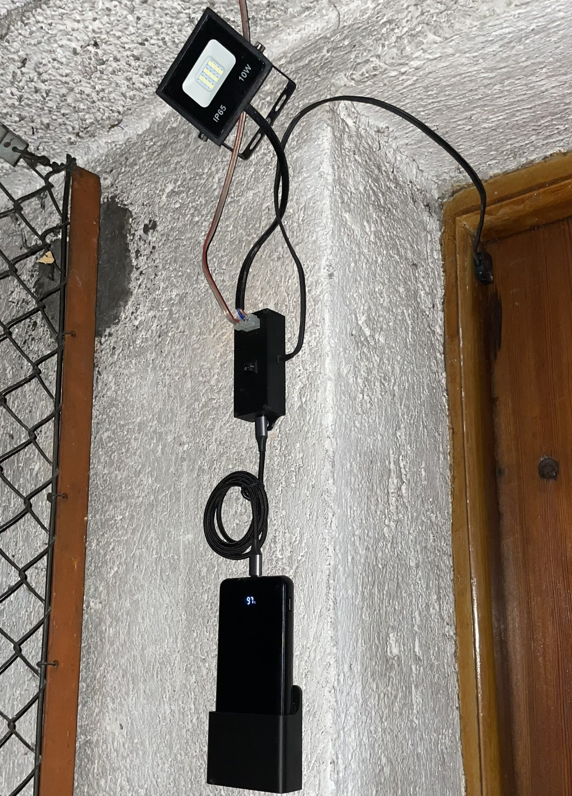

# Garage Parking Assistance System

## Introduction

As an engineer, I like to look for overcomplicated solutions to problems that would not even bother normal humans. One of those problems is finding a parking spot in a big city. After searching for a garage nearby, I was “lucky” enough to find an old and tiny garage in which my non-city-compliant car barely fits. Talking to the neighbours has highlighted a potential risk: Gaining too much confidence in parking over time can lead to slips, which were clearly visible on the other cars. So I started thinking about a garage parking assistance system. For me, it was crucial to find the balance between a simple and overcomplicated solution. Mirrors could be simple, while time-of-flight sensors that communicate with a display system via the Modubus protocol are unnecessarily complicated. So I decided to use a cross line laser to visually support the driver, which turned out to work better than expected. Following system requirements emerged with the decision:

- The system shall be battery powered only. *Reason: No electricity and sunlight available in the garage.*
- The system shall support a mini spotlight.
- The system shall support a door switch.

## Principle

The basic idea is to use a cross line laser to draw a perfectly centred line on objects. Two alignment markers on the dashboard are used to keep the vehicle centered while driving into the garage. The first picture shows the driver's view.

## Designing the system

### Electronics

I started off by ordering a 5V 100 mW cross line laser module, which is used for stone marking, woodwork, cutting clothes, etc. For lighting, I found a direct current 12 V 10 W LED spotlight. I used a 20,000 mAh USB-C Power Delivery (PD) power bank as an energy source, which hopefully only needs to be recharged every few months. In order to set the correct voltage and turn off the power bank when not in use, I bought a USB Type-C PD decoy trigger module. According to the [USB Type-C specification](https://www.usb.org/sites/default/files/USB%20Type-C%20Spec%20R2.0%20-%20August%202019.pdf), two pins on the connector, CC1 and CC2, are used to establish and manage the source-to-sink connection. In this case, the power bank detects the presence of the trigger module through 5.1 kΩ pull down resistors connected to CC1 and CC2. Knowing this, the pins can be used to simulate a device being attached or detached by simply switching the lines. I chose to switch the CC1 line only, wich reduces the complexity further. Switching only one line has the disadvantage of loosing the connector flip-ability on the trigger module side, which is neglegible in this case. The trigger module is set to produce 12 V and another step-down module is used to generate the 5 V needed for the laser. Soldering everything on a breadboard lead to the following design:

  
  

### Mechanics

The PCB needs to be embedded into a housing. Therefore, I [designed](https://cad.onshape.com/documents/e562ef9e716ed1b7ecb98e04/w/4fbb80f0db417c27cfb7b5d2/e/0cdb2197ac67379112fd8f6a?renderMode=0&uiState=6702991162c07d4091c206ba) and 3D-printed a wall-mountable PCB case. To quickle remove or exchange the power bank, I also added a [power bank wall mount](https://cad.onshape.com/documents/1ac97c5aeb0e7f71d6ad7284/w/f293ab10e853d42267acb17b/e/1ccc89e5bb1764f0674238b5?renderMode=0&uiState=67029b8af527466fade282f0).

  
  

